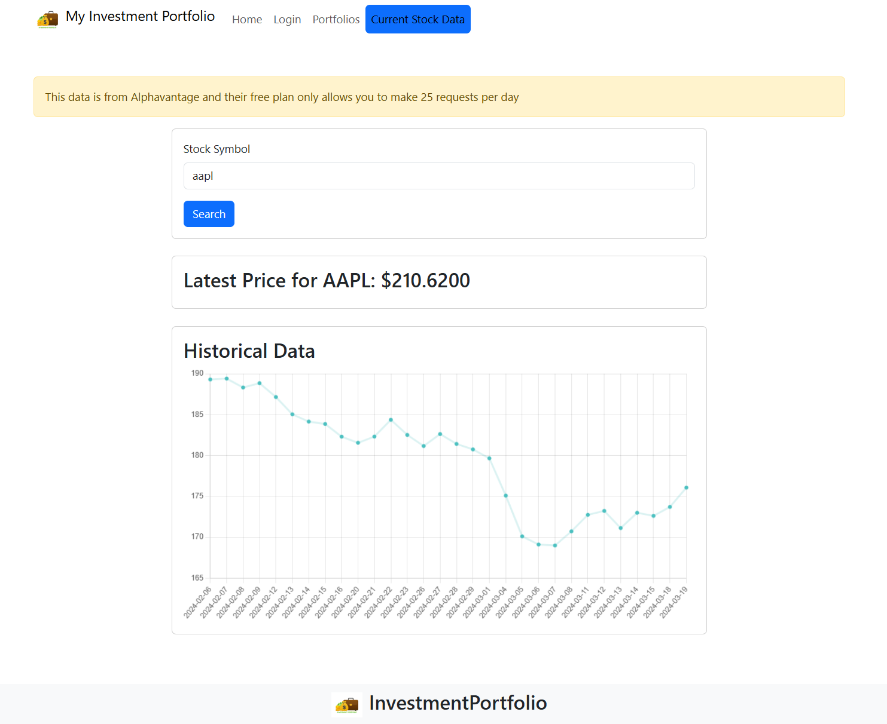

# Investment Portfolio

This project is an Investment Portfolio website consisting of a frontend built using React and Bootstrap, and a backend built using .NET WebAPI, Swagger, and Entity Framework. The application allows users to create accounts, log in with basic authentication, manage their investment portfolios, view graphs of current stock prices, and perform buy and sell operations for stocks.



## Summary of the Project

### Frontend

- **User Authentication**: Users can create accounts and log in with basic authentication.
- **Financial Data Retrieval**: Fetches and displays financial data from AlphaVantage.
- **Responsive Design**: Utilizes Bootstrap for responsive UI components.
- **Stock Information**: View graphs of current stock prices.
- **Portfolio Management**: Add stocks to each portfolio, including buy and sell operations.

### Backend

- **.NET WebAPI**: Provides the API endpoints for the frontend.
- **Swagger**: Used for API documentation and testing.
- **Entity Framework**: Manages database interactions.
- **Authentication**: Uses basic authentication and cookies to save account login details.

## How to Run the Project

### Frontend

1. **Clone the repository**:
   ```sh
   git clone https://github.com/aahad-a/investment-portfolio-frontend.git
   cd investment-portfolio-frontend/investment_portfolio
   ```
2. **Install dependencies and Run the app**:
   ```sh
   npm install
   npm start
   ```
3. This will start the application at http://localhost:3000.

### Backend
1. **Clone the repository and run the project**:
```
git clone https://github.com/aahad-a/investment-portfolio-backend.git
cd investment-portfolio-backend
dotnet build
dotnet run
```

